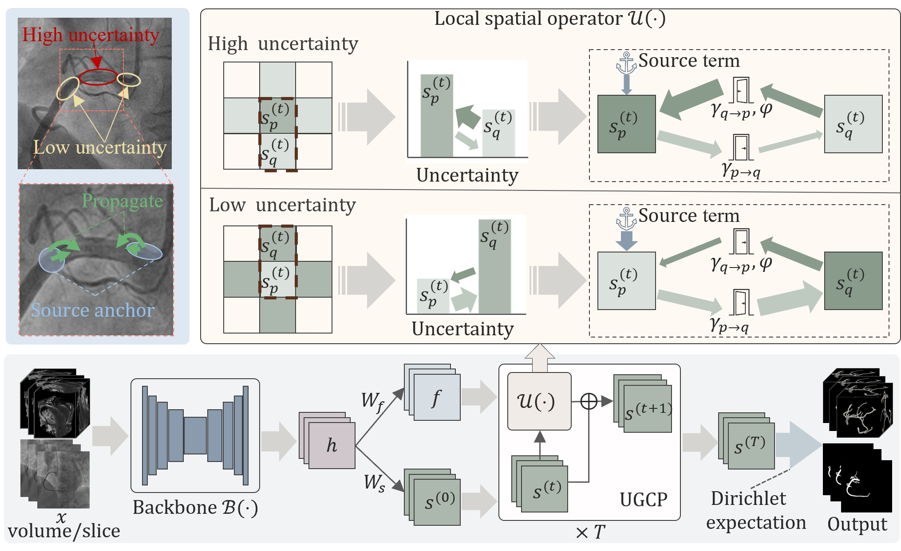

# Uncertainty-Guided Conservative Propagation for Coronary Artery Segmentation
Accurate coronary artery segmentation plays a critical role in coronary artery disease diagnosis and treatment planning. However, existing deep learning approaches are predominantly formulated as point-wise classification paradigms, where predictions are produced in a single forward pass without an explicit inference-stage structured update mechanism. This limitation becomes particularly evident in regions with ambiguous image evidence or weak structural support. We propose an Uncertainty-Guided Conservative Propagation (UGCP) framework that reformulates segmentation inference as a finite-step, structure-aware state evolution process in logit space via constrained neighborhood updates guided by conservative interaction. The update is driven by local prediction discrepancies and modulated by voxel-wise uncertainty, allowing high-confidence regions to guide structurally unstable areas in a controlled manner. A source term anchors the update to the initial logits, preventing excessive drift during structural correction. We evaluate the proposed framework on convolutional and Transformer-based segmentation backbones using public 2D invasive coronary angiography (ICA) and 3D coronary CT angiography (CCTA) datasets (616 ICA images and 1,000 CCTA volumes). Experimental results demonstrate consistent improvements in the Dice similarity coefficient (DSC), clDice, and boundary metrics across architectures. The proposed framework enhances inference-stage structural consistency and shows strong potential for improving the robustness of coronary artery analysis in clinical settings.

# code training

# testing

# environment

- matplotlib==3.10.8
- monai==1.5.1
- nibabel==5.3.3
- numpy==2.4.2
- pandas==3.0.1
- scikit_learn==1.8.0
- scipy==1.17.1
- simpleitk==2.5.3
- torch==2.9.1
- tqdm==4.66.4

